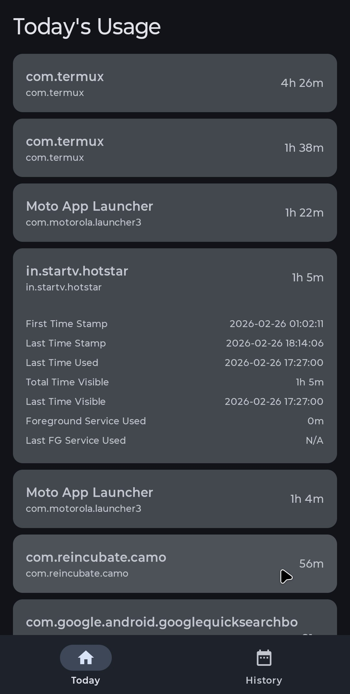
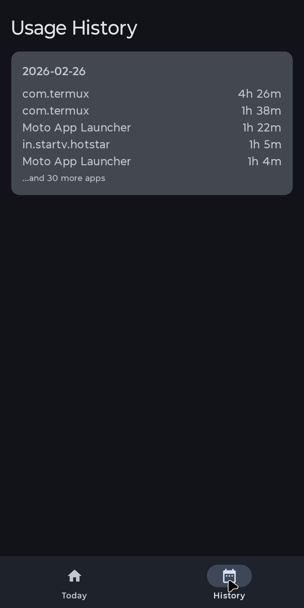

# Usage Access Monitor

[](https://github.com/syslabtech/android-usage-tracker/actions/workflows/build.yml)

Welcome to the **Usage Access Monitor** repository! This is an open-source Android application designed to capture and display detailed usage information for applications on your device. The goal is to help you understand your app usage patterns to make informed decisions and improve your self-awareness regarding app permissions.

## Features
- **Usage Tracking:** Monitor how much time you spend on each app daily.
- **Detailed Analytics:** View detailed historical usage data and access logs.
- **Local Storage:** Securely store your usage data on your device without relying on external servers.
- **Privacy Focused:** Your data never leaves your phone, ensuring complete privacy.
- **Modern UI:** Built with Jetpack Compose using modern Android development practices.

## Screenshots
<p align="center">
  
  
</p>

## Getting Started

### Prerequisites
- Android Studio (Ladybug or newer recommended)
- Android SDK (API level 34+)
- A physical Android device or emulator running Android 9 (API 28) or higher.

### Installation
1. Clone the repository:
   ```bash
   git clone https://github.com/yourusername/usage-access-monitor.git
   ```
2. Open the project in Android Studio.
3. Sync the project with Gradle files.
4. Build and run the app on your emulator or physical device.
5. On the first launch, the app will prompt you to grant **Usage Access** permissions. This is required for the application to function correctly.

### Signed Releases

This repository is configured to automatically build and attach **Signed Release APKs** to GitHub Releases simply by pushing to the `master` branch. Each push will automatically generate a new release using the build number.

To enable this feature, you must configure the following **Repository Secrets** in your GitHub Settings (`Settings > Secrets and variables > Actions > New repository secret`):

- `SIGNING_KEY`: The base64-encoded string of your generated `.keystore` file.
- `ALIAS`: The alias you used when generating the keystore.
- `KEY_STORE_PASSWORD`: The password for your keystore.
- `KEY_PASSWORD`: The password for your key.

> **Note:** Included in this repo is a helper script `generate_keystore.sh` that you can run locally to generate the required keystore file and display instructions on how to obtain the base64-encoded string for the `SIGNING_KEY` secret. Make sure never to commit your real `.keystore` file!

## Tech Stack
- **Language:** Kotlin
- **UI Toolkit:** Jetpack Compose
- **Build System:** Gradle (Kotlin DSL)
- **Architecture:** MVVM (Model-View-ViewModel)

## Contributing
Contributions, issues, and feature requests are welcome! 
If you have suggestions for improving the app or want to report a bug, please check the [issues page](../../issues).

## License
Copyright 2026 Syslabtech LLC

This project is licensed under the [Apache License 2.0](LICENSE) - see the [LICENSE](LICENSE) file for details.
